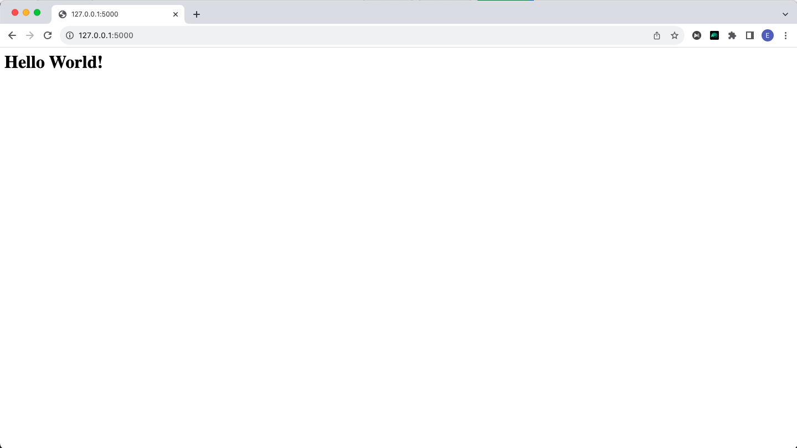
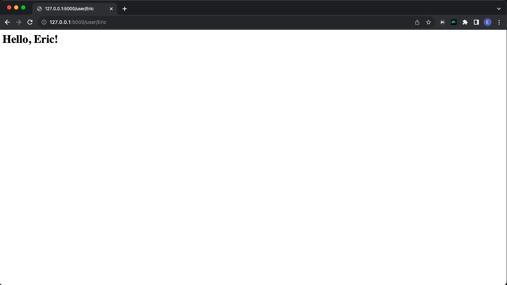
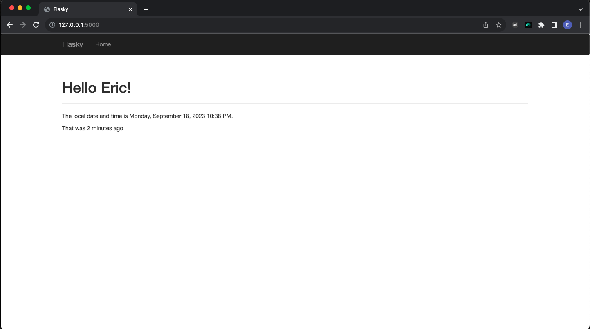
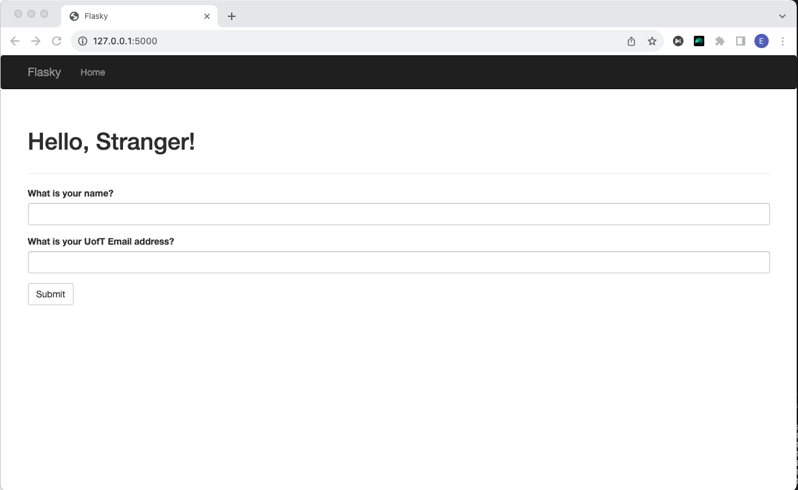
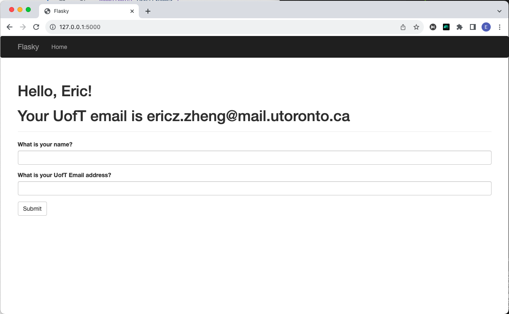
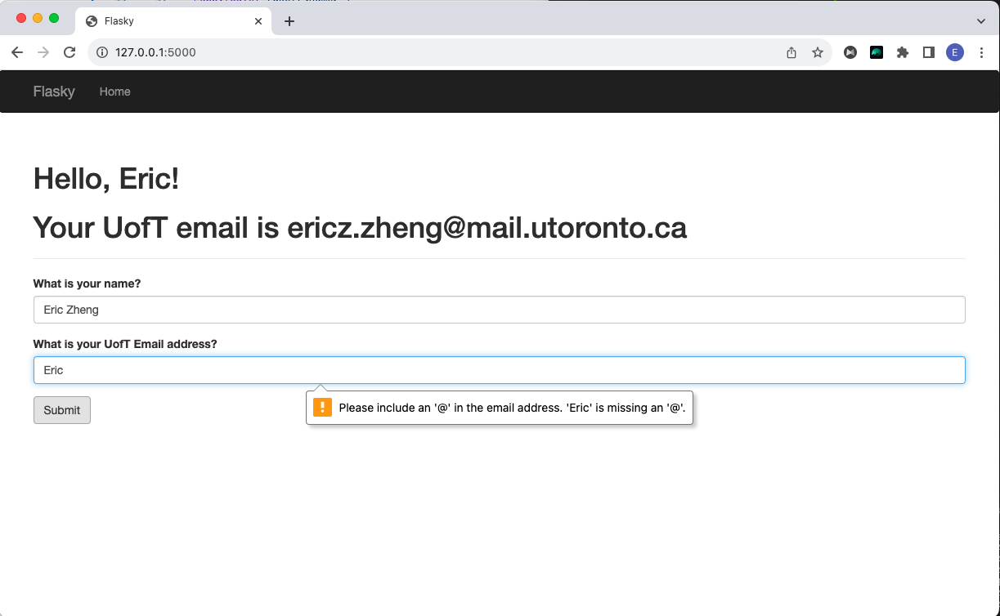
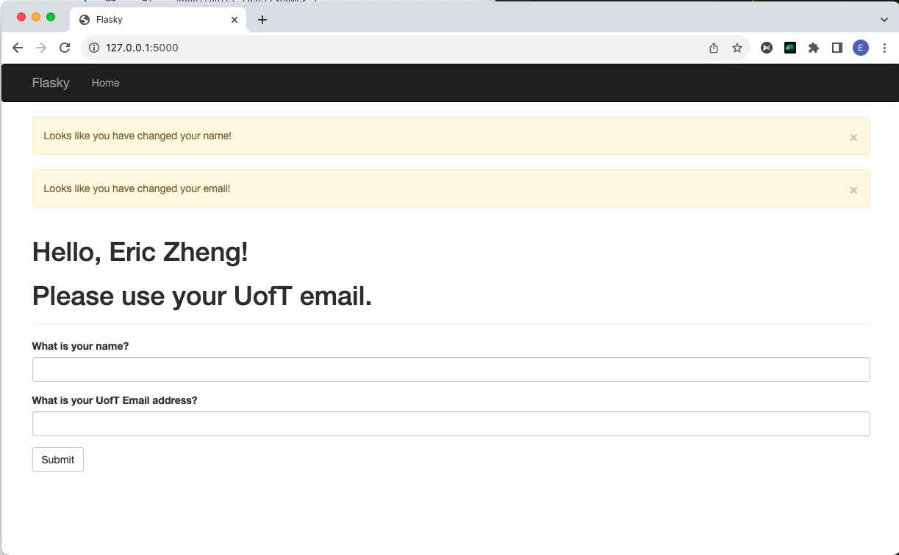

# ECE444-F2023-Lab1
this repo is a clone of https://github.com/miguelgrinberg/flasky.   
Activity 1 ScreenShot:   
   
Activity 2 ScreenShot:   
   
   
Activity 3 ScreenShot:   
   
Activity 4 Screenshot:   
   
   
   
   
